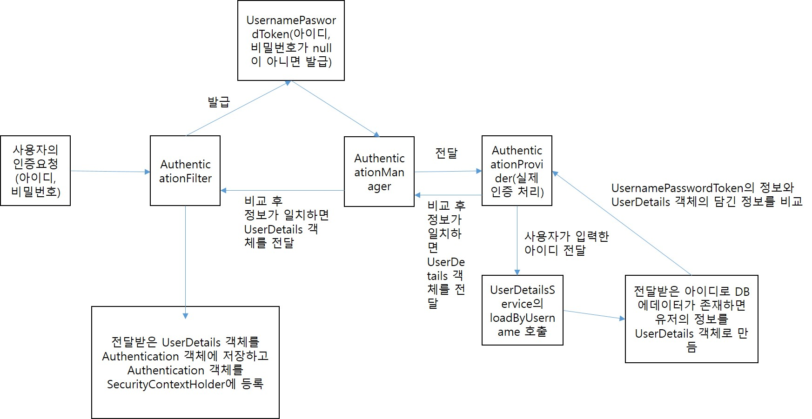

# 1. Spring Security
## 1. Spring Security란?
1. Spring Security는 Spring 애플리케이션에 보안(인증(로그인))과 인가(권한에 따른 사용분리) 등)을 담당하는 스프링 하위 프레임워크로 주로 웹 애플리케이션의 보안을 책임지며, 세션 관리, 비밀번호 암호화, 권한 설정 등 다양한 기능을 제공한다.
2. 주요 기능
    - 인증(Authentication): 사용자가 누구인지 확인.
    - 인가(Authorization): 사용자가 무엇을 할 수 있는지 결정.
    - 세션 관리: 사용자 세션을 관리하고 보호.
    - 비밀번호 암호화: 사용자의 비밀번호를 안전하게 저장.
    - CSRF 보호: 크로스 사이트 요청 위조 공격을 방지.
2. Spring Security 설정
    ```
    dependencies {
        implementation 'org.springframework.boot:spring-boot-starter-security'
        implementation 'org.springframework.boot:spring-boot-starter-web'
    }
    ```
    - Spring Boot 프로젝트에서 spring-boot-starter-security 의존성을 추가하면, 기본적으로 모든 엔드포인트가 보호되고 로그인 폼이 제공.
    - 기본 사용자 계정: Spring Security는 기본적으로 user라는 사용자 이름과 랜덤으로 생성된 비밀번호를 사용하며 애플리케이션이 시작되면 콘솔에 비밀번호가 출력된다.
3. 사용자 정의 보안 설정
    - SecurityConfiguration 클래스에서 Spring Security 설정을 커스터마이징할 수 있다.
    ```
    import com.bit.springboard.handler.LoginFailureHandler;
    import com.bit.springboard.oauth.OAuth2UserServiceImpl;
    import lombok.RequiredArgsConstructor;
    import org.springframework.context.annotation.Bean;
    import org.springframework.context.annotation.Configuration;
    import org.springframework.security.config.annotation.web.builders.HttpSecurity;
    import org.springframework.security.config.annotation.web.configuration.EnableWebSecurity;
    import org.springframework.security.config.annotation.web.configurers.AbstractHttpConfigurer;
    import org.springframework.security.crypto.bcrypt.BCryptPasswordEncoder;
    import org.springframework.security.crypto.password.PasswordEncoder;
    import org.springframework.security.web.SecurityFilterChain;

    @Configuration
    // @EnableWebSecurity: SpringSecurity의 FilterChain을 구성하기 위한 어노테이션
    @EnableWebSecurity
    @RequiredArgsConstructor
    public class SecurityConfiguration {
        // 소셜 로그인 시 loadUser 메소드가 실행될 서비스 객체 생성
        private final OAuth2UserServiceImpl oAuth2UserService;

        // 로그인 실패 핸들러 객체 생성
        private final LoginFailureHandler loginFailureHandler;

        // 비밀번호 암호화 객체 bean 객체로 등록
        // 비밀번호 암호화와 UsernamePassworToken의 비밀번호와 CustomUserDetails 객체의 비밀번호를 비교하기 위한 passwordEncoder 객체 생성
        // 암호화된 비밀번호는 다시는 복호화할 수 없다.
        // PasswordEncoder에 있는 matches(암호화되지 않은 비밀번호, 암호화된 비밀번호)메소드를 이용해서 값을 비교한다. 일치하면 true, 일치하지 않으면 false
        @Bean
        public static PasswordEncoder passwordEncoder() {
            return new BCryptPasswordEncoder();
        }

        // SpringSecurity의 FilterChain을 구성
        @Bean
        public SecurityFilterChain filterChain(HttpSecurity httpSecurity) throws Exception {
            return httpSecurity
                    //csrf 공격에 대한 옵션 꺼두기
                    //csrf(Cross Site Request Forgery): 사이트간 위조 요청을 하는 공격
                    //                                  정상적인 사용자가 의도치 않은 위조 요청을 보내는 것을 의미
                    //                                  논 브라우저 클라이언트(Rest API 역할만 하는 어플리케이션)에서는 꺼둬도 무방하다.
                    .csrf(AbstractHttpConfigurer::disable)
                    //요청 주소에 대한 권한 설정
                    .authorizeHttpRequests((authorizeRequests) -> {
                        // '/'요청은 모든 사용자가 접근 가능하도록 설정
                        authorizeRequests.requestMatchers("/").permitAll();
                        // css, js, image 등 정적 리소스들에 대한 요청도 모든 사용자가 접근 가능하도록 설정
                        authorizeRequests.requestMatchers("/css/**").permitAll();
                        authorizeRequests.requestMatchers("/js/**").permitAll();
                        authorizeRequests.requestMatchers("/images/**").permitAll();
                        authorizeRequests.requestMatchers("/upload/**").permitAll();
                        // /user/로 시작하는 요청
                        authorizeRequests.requestMatchers("/user/id-check").permitAll();
                        authorizeRequests.requestMatchers("/user/join").permitAll();
                        authorizeRequests.requestMatchers("/user/login").permitAll();
                        authorizeRequests.requestMatchers("/user/login-view").permitAll();
                        authorizeRequests.requestMatchers("/user/join-view").permitAll();
                        // 사용자 정보 변경인 '/user/change-user-info' 요청은 로그인된 사용자만 접근 가능하도록
    //                    authorizeRequests.requestMatchers("/user/change-user-info").authenticated();
                        authorizeRequests.requestMatchers("/api/**").permitAll();
                        // 권한으로 접근제어
                        // 게시판의 모든 요청 'USER', 'ADMIN' 권한을 가진 사용자만 접근 가능하도록 설정
                        authorizeRequests.requestMatchers("/board/**").hasAnyRole("USER", "ADMIN");
                        // 관리자 페이지에 대한 접근제어
                        authorizeRequests.requestMatchers("/admin/**").hasRole("ADMIN");
                        // 위에 설정한 요청외의 모든 요청은 인증된 사용자(로그인한 사용자)만 접근가능하도록 설정
                        authorizeRequests.anyRequest().authenticated();
                    })
                    // 로그인, 로그아웃 설정
                    // AuthenticationProvider객체에 전달할 사용자가 입력한 아이디와 비밀번호로
                    // UsernamePasswordToken 생성해서 전달하는 과정을 구성
                    .formLogin((formLogin) -> {
                        // 로그인 페이지 설정
                        formLogin.loginPage("/user/login-view");
                        // SpringSecurity에서는 기본적으로 username을 아이디로 password를 비밀번호로 사용
                        formLogin.usernameParameter("userId");
                        formLogin.passwordParameter("userPw");
                        // 로그인 처리하는 요청 url 지정
                        // 지정된 url의 요청이 왔을 때 SpringSecurity에서 인터셉트해서 인증처리를 알아서 진행
                        formLogin.loginProcessingUrl("/user/loginProc");
                        // 로그인 실패 시 동작할 핸들러 클래스 등록
                        formLogin.failureHandler(loginFailureHandler);
                        // 로그인 성공 시 요청을 보낼 url 지정
                        formLogin.defaultSuccessUrl("/");
                    })
                    //OAuth2 기반 로그인 설정
                    .oauth2Login((oauth2Login) -> {
                        oauth2Login.loginPage("/user/login-view");
                        // 자원 서버로부터 전달받은 사용자 정보에 대한 처리를 어느 클래스에서 할 것인지 지정
                        oauth2Login.userInfoEndpoint(userInfoEndpointConfig -> {
                            userInfoEndpointConfig.userService(oAuth2UserService);
                        });
                    })
                    // 로그아웃 처리
                    .logout((logout) -> {
                        // 로그아웃 요청 url 지정
                        logout.logoutUrl("/user/logout");
                        // 사용자 인증정보가 저장된 security context가
                        // HttpSession에 저장되기 때문에 세션을 만료시켜서
                        // security contest를 제거한다.
                        logout.invalidateHttpSession(true);
                        // 로그아웃 성공 시 요청을 보낼 url 지정
                        logout.logoutSuccessUrl("/user/login-view");
                    })
                    .build();
        }
    }
    ```
4. 인증 (Authentication)
    - 기본 인증 흐름
        - 사용자가 화면에서 username(사용자ID)와 password(사용자 비밀번호)를 입력하고 인증요청을 보낸다.
        - AuthenticationFilter(구현체인 UserNamePasswordAuthenticationFilter)가 사용자가 보낸 인증요청을 인터셉트한다(가로챈다). 사용자가 입력한 아이디와 비밀번호에 대한 유효성검사를 진행(입력한 값이 null인지 아닌지를 검사).
        - 유효성 검사가 끝나면(null이 입력되지 않았을 때) 사용자가 입력한 아이디와 비밀번호로 인증용 객체인 UsernamePasswordAuthenticationToken을 만들어서 AuthenticationManager(구현체인 ProviderManager)로 전달한다.
        - AuthenticationManager에서는 실제 인증을 해줄 AuthenticationProvider로 인증용 객체인 UsernamePasswordAuthenticationToken을 전달.
        - AuthenticationProvider에서 전달받은 인증용 객체로 실제 인증 과정을 처리한다.
        - 실제 인증 처리과정1: DB에서 사용자 정보를 가져올 UserDetailsService 객체에 아이디를 넘겨주고 loadByUsername이라는 메소드를 통해서 해당 아이디의 사용자가 존재하는 지 검사. 사용자가 존재하면 인증에서 사용할 사용자 정보(아이디, 비밀번호, 권한 등)를 UserDetails 객체에 담아서 AuthenticationProvider로 객체를 리턴.
        - 실제 인증 처리과정2: AuthenticationProvider에서는 전달받은 UserDetails 객체의 정보와 UsernamePasswordAuthenticationToken의 정보를 비교한다. 인증(DB의 아이디, 비밀번호와 사용자가 입력한 아이디, 비밀번호가 같으면)이 완료되면 사용자 정보를 가지고 있는 UserDetails객체를 Authentication 객체에 등록하고 Authentication 객체 자체를 SecurityContextHolder에 등록한다.
        - 
4. 인가 (Authorization)
    - Spring Security는 사용자 역할(Role)을 기반으로 인가를 처리.
    ```
    //요청 주소에 대한 권한 설정
    .authorizeHttpRequests((authorizeRequests) -> {
        // '/'요청은 모든 사용자가 접근 가능하도록 설정
        authorizeRequests.requestMatchers("/").permitAll();
        // css, js, image 등 정적 리소스들에 대한 요청도 모든 사용자가 접근 가능하도록 설정
        authorizeRequests.requestMatchers("/css/**").permitAll();
        authorizeRequests.requestMatchers("/js/**").permitAll();
        authorizeRequests.requestMatchers("/images/**").permitAll();
        authorizeRequests.requestMatchers("/upload/**").permitAll();
        // /user/로 시작하는 요청
        authorizeRequests.requestMatchers("/user/id-check").permitAll();
        authorizeRequests.requestMatchers("/user/join").permitAll();
        authorizeRequests.requestMatchers("/user/login").permitAll();
        authorizeRequests.requestMatchers("/user/login-view").permitAll();
        authorizeRequests.requestMatchers("/user/join-view").permitAll();
        // 사용자 정보 변경인 '/user/change-user-info' 요청은 로그인된 사용자만 접근 가능하도록
        authorizeRequests.requestMatchers("/api/**").permitAll();
        // 권한으로 접근제어
        // 게시판의 모든 요청 'USER', 'ADMIN' 권한을 가진 사용자만 접근 가능하도록 설정
        authorizeRequests.requestMatchers("/board/**").hasAnyRole("USER", "ADMIN");
        // 관리자 페이지에 대한 접근제어
        authorizeRequests.requestMatchers("/admin/**").hasRole("ADMIN");
        // 위에 설정한 요청외의 모든 요청은 인증된 사용자(로그인한 사용자)만 접근가능하도록 설정
        authorizeRequests.anyRequest().authenticated();
    })
    antMatchers를 사용하여 특정 경로에 대한 접근 권한을 설정한다.
    ```
5. 기타 주요 보안 기능
    - 비밀번호 암호화: Spring Security는 비밀번호를 안전하게 저장하기 위해 PasswordEncoder를 제공한다.
    ```
    // 비밀번호 암호화 객체 bean 객체로 등록
    // 비밀번호 암호화와 UsernamePassworToken의 비밀번호와 CustomUserDetails 객체의 비밀번호를 비교하기 위한 passwordEncoder 객체 생성
    // 암호화된 비밀번호는 다시는 복호화할 수 없다.
    // PasswordEncoder에 있는 matches(암호화되지 않은 비밀번호, 암호화된 비밀번호)메소드를 이용해서 값을 비교한다. 일치하면 true, 일치하지 않으면 false
    @Bean
    public static PasswordEncoder passwordEncoder() {
        return new BCryptPasswordEncoder();
    }
    BCryptPasswordEncoder를 사용하여 비밀번호를 암호화하고, 비교할 때도 동일한 인코더를 사용한다.
    ```
    - CSRF 보호: CSRF 공격을 방지하기 위해 Spring Security는 기본적으로 CSRF 보호를 활성화한다. CSRF 토큰은 폼에 자동으로 추가되며, 서버에서 이를 검증한다.
    ```
    //csrf 공격에 대한 옵션 꺼두기
    //csrf(Cross Site Request Forgery): 사이트간 위조 요청을 하는 공격
    //                                  정상적인 사용자가 의도치 않은 위조 요청을 보내는 것을 의미
    //                                  논 브라우저 클라이언트(Rest API 역할만 하는 어플리케이션)에서는 꺼둬도 무방하다.
    .csrf(AbstractHttpConfigurer::disable)
    ```

## 2. OAuth2
1 OAuth2란?
    - OAuth 2.0(Open Authorization)은 인터넷 사용자들이 비밀번호를 제공하지 않고서도 애플리케이션이나 서비스 간에 자원을 안전하게 공유할 수 있도록 설계된 인증 프로토콜. OAuth2는 주로 웹 애플리케이션과 API에서 사용된다.
2. OAuth2의 주요 개념
    - Resource Owner(자원 소유자): 사용자로서 자신의 자원에 대한 접근 권한을 가진 주체.
    - Client(클라이언트): 자원 소유자를 대신하여 자원에 접근하고자 하는 애플리케이션.
    - Authorization Server(인증 서버): 클라이언트를 인증하고 접근 토큰을 발급하는 서버.
    - Resource Server(자원 서버): 보호된 자원을 제공하는 서버로, 클라이언트는 인증 토큰을 통해 자원에 접근.
3. OAuth2 흐름
    - 사용자 인증: 사용자는 클라이언트 애플리케이션에 로그인한다.
    - 승인 요청: 클라이언트는 인증 서버에 권한 요청을 보낸다.
    - 승인 코드 발급: 인증 서버는 사용자가 승인하면 클라이언트에 승인 코드를 발급한다.
    - 액세스 토큰 발급: 클라이언트는 인증 서버에 승인 코드를 제출하고 액세스 토큰을 받는다.
    - 자원 요청: 클라이언트는 자원 서버에 액세스 토큰을 제출하고 보호된 자원에 접근한다.
4. OAuth2 인증 그랜트 유형
    - OAuth2에서는 여러 가지 인증 그랜트 유형을 제공하며 각 유형은 특정 상황에서 유용하게 사용된다.
        - Authorization Code Grant: 가장 일반적인 OAuth2 인증 방식으로, 주로 서버 간 통신에 사용된다.
            - 흐름: 사용자 -> 클라이언트 -> 인증 서버 -> 승인 코드 -> 클라이언트 -> 액세스 토큰.
    - Implicit Grant: 클라이언트 애플리케이션이 신뢰할 수 없는 환경(예: 브라우저)에서 액세스 토큰을 직접 발급받을 때 사용한다.
            - 흐름: 사용자 -> 클라이언트 -> 인증 서버 -> 액세스 토큰.
    - Resource Owner Password Credentials Grant: 자원 소유자의 사용자 이름과 비밀번호를 직접 받아서 클라이언트가 인증 서버에 제출한다.
        - 흐름: 사용자 -> 클라이언트 -> 사용자 이름 및 비밀번호 -> 인증 서버 -> 액세스 토큰.
        - 보안상 권장되지 않는 방법으로, 신뢰할 수 있는 클라이언트에서만 사용해야 합니다.
    - Client Credentials Grant: 클라이언트가 자신의 자격 증명(클라이언트 ID 및 클라이언트 시크릿)을 사용하여 인증 서버에 액세스 토큰을 요청한다.
        - 흐름: 클라이언트 -> 인증 서버 -> 액세스 토큰.

## 3. Spring Security OAuth2 소개
1. Spring Security OAuth2란?
    - Spring Security OAuth2는 Spring 기반 애플리케이션에서 OAuth2 인증과 권한 부여를 쉽게 구현할 수 있도록 도와주는 라이브러리. 다양한 OAuth2 인증 흐름을 지원하며, 소셜 로그인, 토큰 기반 인증 등을 간편하게 설정할 수 있다.
2. 주요 기능
    - OAuth2 클라이언트: 애플리케이션이 OAuth2 인증 서버와 상호작용하여 사용자 인증을 처리할 수 있게 한다.
    - OAuth2 로그인: 소셜 로그인 기능을 구현할 수 있다.
    - 리소스 서버 보호: OAuth2 토큰을 통해 보호된 자원에 대한 접근을 제어할 수 있다.
    - 토큰 관리: 액세스 토큰과 리프레시 토큰의 발급 및 검증을 처리한다.
4. Spring Security OAuth2 설정
    ```
    dependencies {
        implementation 'org.springframework.boot:spring-boot-starter-security'
        implementation 'org.springframework.boot:spring-boot-starter-oauth2-client'
        implementation 'org.springframework.boot:spring-boot-starter-oauth2-resource-server'
    }
    ```